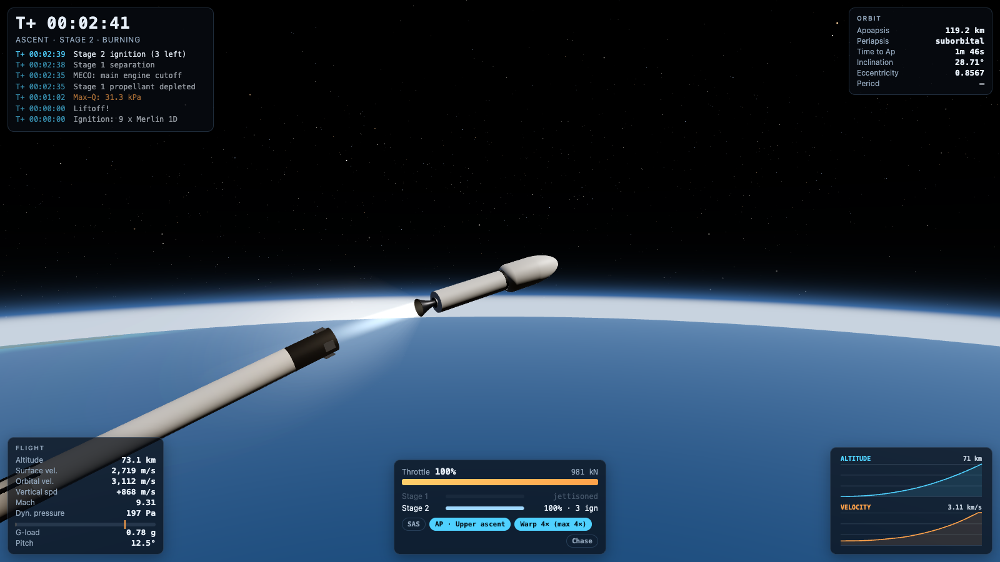

# Rocket Sim

A browser-based 3D launch simulator: fly a two-stage, Falcon 9-class rocket from the pad
to low Earth orbit, by hand or with a closed-loop autopilot. Under the three.js visuals is
a framework-free physics core in TypeScript. It models a rotating spherical Earth, the
1976 standard atmosphere, Mach-dependent drag, pressure-dependent thrust, rigid-body
attitude dynamics and real orbital mechanics. An end-to-end test flies the autopilot
headless and asserts that the vehicle reaches a stable orbit.

**Live demo: [usertrv.dev/projects/rocket-sim](https://usertrv.dev/projects/rocket-sim/)**



## Features

- **Physics you can check.** Fixed-step RK4 integration, inverse-square gravity,
  a rotating Earth (the pad starts with ~408 m/s of eastward speed), US Standard
  Atmosphere 1976, transonic drag rise, max-Q, thrust that grows from its sea-level
  to its vacuum value as the air thins, mass flow from Isp, staging and limited engine relights.
- **Real attitude dynamics.** Torque from engine gimbal and RCS, moments of inertia
  that change as propellant burns, and aerodynamic damping. The vehicle turns
  gradually; nothing snaps to a new attitude. SAS holds attitude with a saturation-aware controller.
- **An autopilot that flies the whole mission** (press `G`): vertical rise, pitch-over,
  gravity turn with q and g limits, MECO and staging, terminal guidance into a transfer
  orbit, coast (it lets you warp) and a circularisation burn at apoapsis.
- **Orbital mechanics HUD**: apoapsis and periapsis, time to apoapsis, inclination,
  eccentricity and period, all derived from the state vector every step.
- **Visuals**: a procedural Earth (continents, biomes, clouds, city lights at night;
  no texture downloads), a ray-marched atmosphere that is blue from the ground and a
  thin limb from orbit, a starfield, an exhaust plume that balloons in vacuum,
  smoke from the flame trench, spent stages and fairing halves that fall on their own ballistic paths.
- **Map view** with the predicted orbit, the flown trajectory and apsis markers.
- **Huge scale ranges without jitter**: floating origin (camera-relative rendering) plus a logarithmic depth buffer.
- **Cameras**: chase, free orbit (drag/zoom), long-lens pad tracking camera and an onboard camera.
- **Time warp** up to 1000×. Like KSP, high warp is only available when coasting above the atmosphere.
- **Works on phones**: on-screen throttle, staging, autopilot, camera and attitude controls.
- **Accessibility basics**: keyboard-reachable pause and help, readable HUD contrast,
  `prefers-reduced-motion` damps camera shake.

## Controls

| Key | Action |
| --- | --- |
| `Space` | Launch / stage separation |
| `Shift` / `Ctrl` | Throttle up / down |
| `Z` / `X` | Full throttle / cut throttle (the engine shuts down; relights are limited) |
| `W` / `S` | Pitch down (towards the horizon) / up |
| `A` / `D` | Yaw left / right |
| `Q` / `E` | Roll left / right |
| `T` | SAS: hold current attitude |
| `G` | Autopilot: fly the ascent to orbit |
| `M` | Map view |
| `C` | Cycle cameras |
| `,` / `.` | Time warp down / up |
| `R` | Restart |
| `P` / `Esc` | Pause |
| `H` / `?` | Help |

Drag to orbit the camera, and scroll or pinch to zoom. The table is generated from the same
[`keymap.ts`](src/ui/keymap.ts) that drives the keyboard handler and the in-game help.

**Flying by hand:** launch, tip about 5° east with `W` at roughly 60 m/s, then keep the
nose near your velocity vector. Stage when stage 1 runs dry. Build horizontal speed until
the periapsis clears 150 km. A 200 km circular orbit needs about 7.8 km/s.

## How the physics works

Everything lives in [`src/sim`](src/sim). The directory has no three.js and no DOM, and an ESLint rule enforces that.

| Model | Implementation | Simplification (honestly) |
| --- | --- | --- |
| Frame | Earth-centred inertial, +Y = spin axis; Earth rotates at 7.292×10⁻⁵ rad/s | Spherical Earth (R = 6371 km); no precession or oblateness |
| Gravity | Point mass, μ = 3.986×10¹⁴ m³/s² | No J2, Moon or Sun |
| Integrator | Classic RK4 on position, velocity and mass, fixed 20 ms step (100 ms on rails warp) | Attitude uses semi-implicit Euler at the same step |
| Atmosphere | US Standard Atmosphere 1976: seven layers to 86 km (geopotential altitude, lapse rates, hydrostatic pressure), then log-interpolated tables to 1000 km | Tables above 86 km instead of the full diffusion model; no weather or wind |
| Drag | `F = ½ρv²·Cd(M)·A` against air co-rotating with Earth; Cd follows a transonic drag-rise curve | Drag acts along the air-relative velocity only; no lift from angle of attack |
| Propulsion | Mass flow `ṁ = F_vac / (Isp_vac·g₀)`; thrust `F = throttle·F_vac − p_amb·A_exit`, where the exit area is chosen so sea-level thrust matches the sea-level Isp | Instant throttle response; no ullage or ignition transients |
| Vehicle | Two stages plus fairing and payload, roughly Falcon 9 Full Thrust ([`falcon9.ts`](src/sim/vehicle/falcon9.ts)): min throttle, relight count, gimbal range | Mass properties treat each stage as a uniform cylinder with propellant spread along it |
| Attitude | Euler's equations with torque from gimbal (`T·sin δ·lever arm`) and RCS; aerodynamic pitch damping | No aerodynamic weathervane torque and no thrust side force from gimbal |
| Orbits | Classical elements from (r, v): eccentricity vector, vis-viva, Kepler's equation for time to apsis | Two-body only |
| Events | Liftoff, max-Q (peak detection), MECO/SECO, staging, fairing jettison, orbit (periapsis > 150 km), crash (ground contact) | Crash means any ground contact after liftoff; there are no landing legs |
| Debris | Spent stages and fairing halves get their own RK4 ballistic propagation with tumbling drag | Constant tumble rate |

**Time warp** follows KSP's rules. Up to 4× the full physics runs as usual. Above that
("on rails") warp needs the engines off and the vehicle above 100 km, and the attitude is
frozen. Rails warp uses a 0.1 s RK4 step, which is still thousands of steps per orbit;
tests show energy drift below 10⁻⁸ over five orbits. The loop re-checks the warp limit
after every step, so the vehicle drops out of warp as soon as a limit applies.

### The autopilot

[`autopilot.ts`](src/sim/guidance/autopilot.ts) is a small state machine:

1. **Vertical rise** until 55 m/s, then a **5° pitch-over** towards the launch azimuth.
2. **Gravity turn**: steer along surface prograde, blending into inertial prograde above
   25 km. The throttle holds dynamic pressure under 32 kPa and acceleration under 4.5 g.
3. **MECO → separation → second-stage ignition** once stage 1 is dry.
4. **Upper-stage terminal guidance.** The routine assumes the vertical acceleration varies
   linearly over the remaining burn time *t_go* (from the rocket equation). It solves
   `a₀ = (6Δh − 4v_z·t_go)/t_go²` so the vehicle arrives at the insertion altitude with zero
   vertical speed. The engine supplies `a₀ + g − v_h²/r` vertically, and the remaining
   thrust builds horizontal speed. The target is the periapsis of a 140 × 200 km transfer orbit.
5. **Coast to apoapsis.** The autopilot tells the game how much warp is safe before the burn.
6. **Circularisation at apoapsis**: burn horizontally while nulling vertical speed,
   throttling down for a precise cutoff.

A typical headless run (`pnpm dlx tsx scripts/fly.ts`) gives max-Q 31.3 kPa at T+62 s,
MECO at T+156 s, SECO-1 at T+499 s into a 201 × 140 km orbit, and circularisation to
**201 × 199 km, 28.7° inclination**, with about 9.9 t (9%) of second-stage propellant left.

## Architecture

```
src/
  sim/        Framework-free simulation (tested). No three.js, no DOM.
    math/       vec3 / quaternion helpers (double precision, immutable)
    vehicle/    typed vehicle config, Falcon 9 data, propulsion and mass properties
    guidance/   autopilot state machine and terminal guidance
    atmosphere.ts, aero.ts, dynamics.ts (RK4), attitude.ts, orbit.ts,
    frames.ts, debris.ts, events.ts, time-warp.ts, telemetry*.ts,
    simulation.ts  (the world: step(dt), commands, events)
  render/     three.js: scene graph, floating origin, procedural Earth and atmosphere
              shaders, rocket model from primitives, plume, particles, cameras, map view
  ui/         DOM HUD, canvas telemetry charts, overlays, keyboard and touch input
  app/        Composition root: game loop, fixed-step accumulator, render
              interpolation, mission state machine (pad → ascent → orbit / crashed)
tests/        Vitest: physics, guidance end-to-end, app and UI logic
```

- **Decoupled loop.** Real time (times the warp factor) goes into a
  [fixed-step accumulator](src/app/fixed-stepper.ts). The simulation always advances in
  constant steps, and the renderer interpolates between the last two states, so physics
  does not depend on the frame rate.
- **One-way data flow.** Input becomes commands on the simulation, which produces
  state, telemetry and events. From those the game builds an immutable `RenderFrame` and a
  HUD update. The renderer and the HUD never mutate simulation state.
- **Precision.** The simulation works in float64 metres around Earth's centre. Every
  frame the renderer places objects relative to the vehicle (or Earth's centre in map
  view). A finely tessellated patch of true sphere around the pad covers the
  low-poly globe near the ground.
- **Lifecycle.** Rendering stops while the tab is hidden, the device pixel ratio is capped,
  resizes are observed, and restart disposes per-flight geometry.

## Running locally

Requires Node 22.12+ (CI uses Node 24) and pnpm 10 (exact version in `packageManager`, `corepack enable`).

```bash
pnpm install
pnpm dev          # http://localhost:5173
pnpm test         # Vitest: unit + end-to-end autopilot flight
pnpm lint         # ESLint (typescript-eslint, strict) + tsc --noEmit
pnpm build        # typecheck + production build into dist/
pnpm preview      # serve the production build
```

The build is fully static, with relative asset URLs (`base: './'`) and no CDN or
runtime downloads, so `dist/` can be served from any sub-path by a plain file server.

## Tech stack

TypeScript (strict), [three.js](https://threejs.org/) 0.186, Vite 8, Vitest,
ESLint with typescript-eslint, and GitHub Actions CI. The HUD uses vanilla DOM and canvas, with no UI framework.

## License

[MIT](LICENSE) © 2026 Kirill Levin
